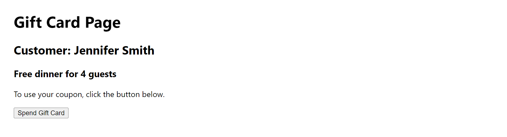
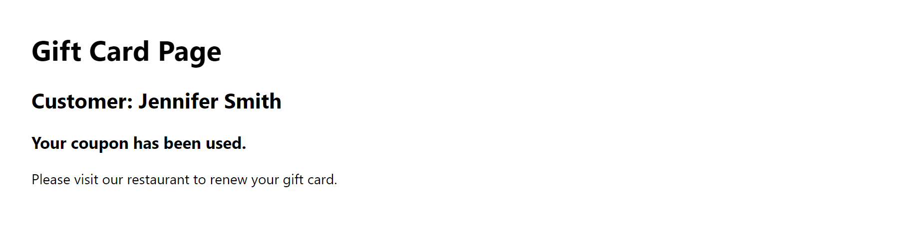

# Little Lemon Gift Card App

## Overview
The **Little Lemon Gift Card App** is a simple React application built with JSX as part of the *Advanced React* course on Coursera. The app displays a gift card page for the fictional Little Lemon Restaurant, allowing a user to "spend" a gift card for a free dinner for four guests. It demonstrates state management in React using the `useState` hook to update an object-based state when the user clicks a button.

## Functionality
The app initially displays the following information:
- **Title**: Gift Card Page
- **Customer**: Jennifer Smith
- **Gift Card Details**: "Free dinner for 4 guests"
- **Instructions**: "To use your coupon, click the button below."
- **Button**: "Spend Gift Card"

When the user clicks the "Spend Gift Card" button, the app updates the state to reflect that the gift card has been used, showing:
- **Updated Details**: "Your coupon has been used."
- **Updated Instructions**: "Please visit our restaurant to renew your gift card."
- The "Spend Gift Card" button disappears after being clicked.

This behavior is achieved by updating the state object (`giftCard`) in the `spendGiftCard` function, which modifies the `text`, `valid`, and `instructions` properties using the `setGiftCard` function and the spread operator (`...prevState`).

## Project Structure
- **App.jsx**: The main React component containing the `useState` hook, the `spendGiftCard` function, and the JSX for rendering the gift card page.
- **index.jsx**: Entry point for the React application (not modified in this lab).

## Screenshots

## Technologies Used
- **React**: For building the user interface.
- **JSX**: For writing the component's UI structure.
- **Create React App**: For the development environment.

## Learning Objectives
This project demonstrates:
- Using the `useState` hook to manage object-based state in React.
- Updating specific properties of a state object using the spread operator.
- Handling user interactions with event handlers (e.g., button clicks).
- Conditionally rendering UI elements based on state (e.g., hiding the button after use).